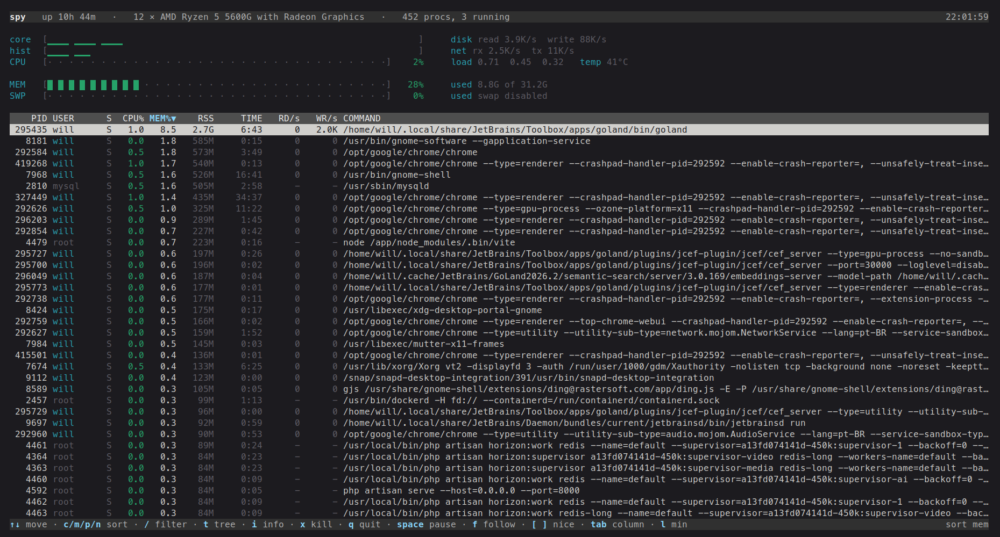

# spy

Terminal system monitor. CPU, memory, disk and network throughput, processes, sorting
and a process tree — all on one screen.

<!--
  Screenshot placeholder: drop the image at docs/screenshot.png and it shows up here.
  A terminal ~120 columns wide, dark theme, with the process list already populated.
-->
<p align="center">
  
</p>

## Install

Linux only — everything is read straight from `/proc`.

### Prebuilt binary

```sh
VERSION=0.1.2                               # github.com/curruwilla/spy/releases
ARCH=$(uname -m | sed 's/x86_64/amd64/; s/aarch64/arm64/')
curl -fsSLO "https://github.com/curruwilla/spy/releases/download/v${VERSION}/spy_${VERSION}_linux_${ARCH}.tar.gz"
tar -xzf "spy_${VERSION}_linux_${ARCH}.tar.gz" spy
sudo install -m 0755 spy /usr/local/bin/spy
```

Every release also ships `.deb`, `.rpm` and `.apk` packages for amd64 and arm64:

```sh
sudo dpkg -i spy_${VERSION}_linux_${ARCH}.deb      # Debian, Ubuntu
sudo rpm -i  spy_${VERSION}_linux_${ARCH}.rpm      # Fedora, RHEL, openSUSE
```

### With Go

Requires Go 1.24+.

```sh
go install github.com/curruwilla/spy/cmd/spy@latest
```

### From source

```sh
make build      # produces bin/spy
make install    # installs into $GOPATH/bin
```

### Verifying a download

`checksums.txt` is signed with keyless [cosign](https://docs.sigstore.dev/), and every
archive and package ships an SPDX SBOM alongside it.

```sh
sha256sum -c checksums.txt --ignore-missing
cosign verify-blob checksums.txt \
  --bundle checksums.txt.sigstore.json \
  --certificate-identity-regexp 'https://github.com/curruwilla/spy/.github/workflows/release.yml@.*' \
  --certificate-oidc-issuer https://token.actions.githubusercontent.com
```

## Usage

```sh
spy                      # default: refreshes every 2s, sorted by CPU
spy -i 500ms             # refresh interval
spy -sort mem            # cpu, mem, pid, name, time or io
spy -tree                # start in tree mode
spy -filter chrome       # start filtered by text
spy -min-cpu 5           # only processes using at least 5% of a core
spy -min-mem 500M        # at least 500 MB resident (or -min-mem 2 for 2% of RAM)
spy -min-time 1m30s      # at least 1m30s of accumulated CPU time (90 = 90s)
spy -min-cpu 5 -min-mem 2 -min-time 1m
spy -version
```

## Keys

| Key | Action |
| --- | --- |
| `↑` `↓` / `j` `k` | move the cursor |
| `PgUp` `PgDn` / `g` `G` | page / top and bottom |
| the mouse | the wheel scrolls, a click picks the row under the pointer |
| `c` `m` `p` `n` `d` | sort by CPU, memory, PID, name, disk |
| `Tab` / `Shift+Tab` | cycle through the columns (TIME and the disk pair included) |
| the same key again | reverse the direction |
| `t` | toggle flat list ↔ process tree |
| `Space` | hold the refresh where it is, and let it go again |
| `f` | follow the selected process: the cursor goes wherever it does |
| `/` | filter by command, user or PID (applies as you type; `Esc` clears) |
| `l` | minimum CPU, memory and time thresholds (`Enter` applies; `Esc` clears) |
| `i` | open the detail panel for the selected process |
| `x` | pick a signal to send to the selected process, with a `y/N` confirmation |
| `[` `]` | renice the selected process, one step towards urgent or patient |
| `q` / `Esc` / `Ctrl+C` | quit |

### Sending a signal

`x` opens the list of signals, the way htop asks: the process at the top, the signals
under it, and the cursor on SIGTERM. `↑` `↓` move, `Enter` picks, and the footer then
asks once more before anything is sent:

```
 1  SIGHUP     reread the configuration, for the daemons that do
 2  SIGINT     what ctrl+c sends
 3  SIGQUIT    stop and leave a core behind
 6  SIGABRT
 9  SIGKILL    cannot be caught, cannot be ignored
10  SIGUSR1    whatever the program decided it means
12  SIGUSR2
15  SIGTERM    ask, rather than insist
18  SIGCONT    carry on
19  SIGSTOP    freeze, and it cannot refuse
20  SIGTSTP    what ctrl+z sends
```

### Changing the priority

`[` and `]` move the selected process along the scheduler's range, from -20 to 19.
Only root may go down towards the urgent end; a refusal is reported in the footer,
like a signal that could not be sent.

### Holding the screen still

`Space` stops the refresh: the last reading stays on the screen, the footer says
`paused`, and the same key starts it again. It is the only way to read a table that
reorders itself every couple of seconds.

`f` is the other half of that: it locks the cursor onto the process under it, so a
process climbing the list takes the highlight with it. Moving the cursor by hand
takes it back, and a process that exits releases it on its own. Without `f` the
cursor keeps its line and the list moves underneath, which is what watching the top
of the table wants.

### Minimum thresholds

`l` (for limit) opens a field where you write the floor for each measure — anything below
it drops out of the table:

```
cpu>5              at least 5% of one core
mem>2              at least 2% of total RAM
mem>500M           or at least 500 MB resident (K, M, G, T, P and B)
time>1m30s         at least 1m30s of accumulated CPU (90 = 90 seconds)
cpu>5 mem>500M     several thresholds at once, all of them have to be met
```

The sign is decoration: `cpu>5`, `cpu>=5`, `cpu 5` and `cpu=5` all mean the same thing,
"at least 5". The two ways of saying memory are alternatives — whichever is written last
replaces the other. The field opens prefilled with what is active, so you edit instead of
retyping, and the `/` text still applies alongside it: the two filters add up.

The `i` panel reads a handful of files that would be too expensive for every row of
the table: what the process has in swap, how many file descriptors it holds, how many
context switches it has made, its OOM score, the binary behind the command line, the
directory it runs in, and the cgroup it was put in — which is the container it runs
in, or the systemd unit that started it. Most of that belongs to the process owner, so
somebody else's process shows what it can and says why the rest is missing.

The panel pins itself to the PID that was under the cursor when you pressed it: the
list keeps reordering behind it, but the panel does not switch processes — only its
numbers update. If the process ends, the panel closes and the footer says which PID left.

The cursor stays with the position, not with the process: it stays on the line where you
left it, and a list refresh does not drag it along behind the process that was selected —
it only pulls it back if the list shrinks and that line stops existing, and `f` is how you
ask for the opposite. Sorting, on the
other hand, sends the screen back to the first row — the point is to see who is at the top
now. In tree mode, a filter also keeps the parents of whatever matched, so the hierarchy
stays readable — this holds for the text as well as for the thresholds.

## Reading the screen

Not everything in the list deserves the same attention, so the row says on its own what it
is:

| Mark | Means |
| --- | --- |
| whole row dimmed | kernel thread (child of `kthreadd`, pid 2) — machine plumbing, never what you are looking for |
| owner highlighted | process of your own account; other accounts stay grey |
| command in bold | it is doing something right now: running, ≥ 1% CPU or ≥ 5% of RAM |
| colored `S` | `R` green is on a core, `D` yellow is stuck in a syscall, `T` stopped, `Z` red is a zombie |
| colored `CPU%` | green up to 50%, yellow up to 80%, red above that |
| `-` under `RD/s` or `WR/s` | the disk counters of that process are closed to you, which is not the same as no traffic |

The CPU, memory and swap bars use the same color scale; the three filled-background lines
(title, table header and footer) follow the terminal's light or dark theme.

The header carries what has no column of its own: `core` is one cell per core, `hist` is
the total over time — the difference between a machine that is busy and one that has
been busy for a while — and on the right of the two, the disk and network throughput.
The processor names itself in the title and its temperature sits next to the load. A
terminal shorter than 22 lines gives the trend line and the network figures back to the
table.

## How it works

| Data | Source |
| --- | --- |
| Total and per-core CPU | `/proc/stat`, difference between two readings |
| Memory and swap | `/proc/meminfo` (`MemAvailable` when present) |
| Load and process count | `/proc/loadavg` |
| Uptime | `/proc/uptime` |
| Processes | `/proc/<pid>/stat`, `/proc/<pid>/cmdline`, owner from the directory's uid |
| Disk throughput | `/proc/diskstats`, whole disks only: partitions, device mapper and software raid are the same bytes again |
| Network throughput | `/proc/net/dev`, real interfaces only: the loopback and the container and virtual machine ends of a bridge carry what a real one already carried |
| Per-process disk | `/proc/<pid>/io`, which needs privileges over the process |
| Processor and temperature | `/proc/cpuinfo`, `/sys/class/thermal` and `/sys/class/hwmon` |
| The `i` panel's extras | `/proc/<pid>/status`, `/cgroup`, `/fd`, `/oom_score`, `/exe` and `/cwd`, read only while the panel is open |

The `/proc` counters are cumulative, so the first screen shows 0% CPU and no
throughput: the rates only exist from the second reading on. `CPU%` is relative to one core, like in `htop` — a
process with several threads can go past 100%.

## Development

```sh
make test     # go test -race ./...
make cover    # total coverage
make lint     # go vet + golangci-lint, if installed
make help     # list the targets
```

The parsers are tested against fixtures in `internal/proc/testdata/proc`, with no
dependency on the machine the test runs on.

## Releasing

Push a tag and the [release workflow](.github/workflows/release.yml) does the rest:

```sh
git tag -a v0.1.0 -m "v0.1.0"
git push origin v0.1.0
```

GoReleaser builds linux/amd64 and linux/arm64, produces the archives, the deb/rpm/apk
packages, the SBOMs and the signed checksums, and publishes the GitHub Release with a
changelog built from the commits. A tag like `v0.1.0-rc1` is published as a pre-release.
